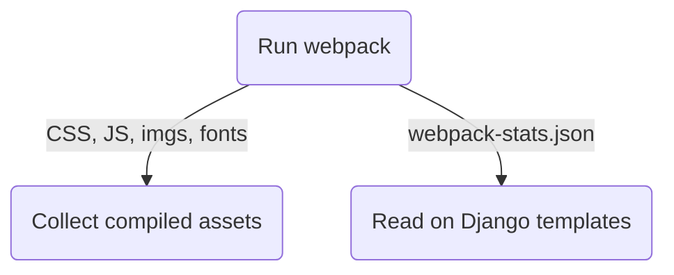

# django-webpack-loader

[](https://circleci.com/gh/django-webpack/django-webpack-loader/tree/master)
[](https://coveralls.io/github/django-webpack/django-webpack-loader?branch=master)


Integrate Webpack bundles in Django templates by using a simple template tag:

```HTML+django


<html>
  <head>
    
  </head>
</html>
```

Behind the scenes, Django Webpack Loader consumes a **stats file** generated by [webpack-bundle-tracker](https://github.com/django-webpack/webpack-bundle-tracker) and lets you use the generated bundles in Django.

A [changelog](CHANGELOG.md) is available.

## Compatibility

Generally, Python, Django, and Node LTS releases will be supported until EOL. Check `tests/tox.ini` for details.  
Versions not listed in `tests/tox.ini` may still work, but maintainers will not test them, nor solve issues with them.  
Examples below are in Webpack 5.

## Install

```bash
npm install --save-dev webpack-bundle-tracker

pip install django-webpack-loader
```

## Configuration

For kick-starting a full example project with opinionated development and production settings, you can check the [`django-react-boilerplate`](https://github.com/vintasoftware/django-react-boilerplate/). For a more flexible configuration, keep reading.

### Configuring `webpack-bundle-tracker`

Before configuring `django-webpack-loader`, let's first configure what's necessary on `webpack-bundle-tracker` side. Update your Webpack configuration file (it's usually on `webpack.config.js` in the project root). Make sure your file looks like this (adapt to your needs):

```javascript
const path = require("path");
const webpack = require("webpack");
const BundleTracker = require("webpack-bundle-tracker");

module.exports = {
  context: __dirname,
  entry: "./assets/js/index",
  output: {
    path: path.resolve(__dirname, "assets/webpack_bundles/"),
    publicPath: "auto", // necessary for CDNs/S3/blob storages
    filename: "[name]-[contenthash].js",
  },
  plugins: [
    new BundleTracker({ path: __dirname, filename: "webpack-stats.json" }),
  ],
};
```

The configuration above expects the `index.js` (the app entrypoint file) to live inside the `/assets/js/` directory (this guide going forward will assume that all frontend related files are placed inside the `/assets/` directory, with the different kinds of files arranged within its subdirectories).

The generated compiled files will be placed inside the `/assets/webpack_bundles/` directory and the **stats file with the information regarding the bundles and assets** (`webpack-stats.json`) will be stored in the project root. You may add `webpack-stats.json` to your `.gitignore`.

### Configuring the Django settings file

First of all, add `webpack_loader` to `INSTALLED_APPS`.

```python
INSTALLED_APPS = (
    ...
    'webpack_loader',
    ...
)
```

Below is the recommended setup for the Django settings file when using `django-webpack-loader`.

```python
STATICFILES_DIRS = (
    os.path.join(BASE_DIR, 'assets'),
)

WEBPACK_LOADER = {
    'DEFAULT': {
        'BUNDLE_DIR_NAME': 'webpack_bundles/',
        'CACHE': not DEBUG,
        'STATS_FILE': os.path.join(BASE_DIR, 'webpack-stats.json'),
        'POLL_INTERVAL': 0.1,
        'IGNORE': [r'.+\.hot-update.js', r'.+\.map'],
    }
}
```

Note that you must set the path where you're keeping your static assets and Webpack bundles in `STATICFILES_DIRS`.

For that setup, we're using the `DEBUG` variable provided by Django. Since in a production environment (`DEBUG = False`) the assets files won't constantly change, we can safely cache the results (`CACHE=True`) and optimize our flow, as `django-webpack-loader` will read the stats file only once and store the assets paths in memory. If `CACHE=False`, we'll always read the stats file to get the assets paths.

The `STATS_FILE` parameter represents the output file produced by `webpack-bundle-tracker`. Since in the Webpack configuration file we've named it `webpack-stats.json` and stored it on the project root, we must replicate that setting on the backend side.

During development, the stats file will change often, therefore we want to always poll for its updated version (every 0.1s, as defined on `POLL_INTERVAL`).

> ⚠️ In production (`DEBUG=False`), we'll only fetch the stats file once, so `POLL_INTERVAL` is ignored.

`IGNORE` is a list of regular expressions. If a file generated by Webpack matches one of the expressions, the file will not be included in the template.

### Compiling the frontend assets

Using Webpack, you must generate the frontend bundle along with the stats file using `webpack-bundle-tracker` before using `django-webpack-loader` in Django templates. Note you'll probably want different configurations in development vs. production. The pipeline should look like this:



In development, we can simply do:

```bash
# in one shell
npx webpack --mode=development --watch

# in another shell
python manage.py runserver
```

Check [the full example for development here](https://github.com/django-webpack/django-webpack-loader/tree/master/examples/simple).

Aditionally, hot reload is available through a specific config. Check [this section](#hot-reload).

> ⚠️ For compiling and serving the frontend assets in production, check [this section](#using-in-production).

## Usage

In order to render the frontend code into the Django templates, we use the `render_bundle` template tag.

Its behavior is to accept a string with the name of an entrypoint from the stats file (in our case, we're using `main`, which is [the default](https://webpack.js.org/concepts/entry-points/#single-entry-shorthand-syntax)) and it'll proceed to include all files under that entrypoint. You can read more about the entrypoints concept [here](https://webpack.js.org/concepts/entry-points/).

> ⚠️ You can also check an example on how to use multiple `entry` values [here](https://github.com/django-webpack/django-webpack-loader/tree/master/examples/code-splitting).

Below is the basic usage for `render_bundle` within a template:

```HTML+Django


<html>
  <head>
    
  </head>
</html>
```

That will render the proper `<script>` and `<link>` tags needed in your template.

## Using in tests

To run tests where `render_bundle` shows up, since we don't have `webpack-bundle-tracker` at that point to generate the stats file, the calls to render the bundle will fail. The solution is to use the `FakeWebpackLoader` in your test settings:

```python
WEBPACK_LOADER['DEFAULT']['LOADER_CLASS'] = 'webpack_loader.loaders.FakeWebpackLoader'
```

## Using in Production

The recommended apporach is to have a production pipeline that generates the frontend bundle along with the stats file during the **deployment phase**. We recommend keeping the generated bundles and the stats file outside the version control. In other words, add `webpack-stats.json` and `assets/webpack_bundles/` to your `.gitignore`.

Assuming static files is properly configured using Django built-ins or something like [django-storages](https://django-storages.readthedocs.io/), a simple production deployment can use Django's own `collectstatic`. Remember the Django settings values of `STATICFILES_DIRS`, `BUNDLE_DIR_NAME`, `STATS_FILE`, and Webpack's `output.path` must all be compatible:

```javascript
// webpack.config.js
module.exports = {
  // ...
  context: __dirname,
  output: {
    // Emit bundle files at "assets/webpack_bundles/":
    path: path.resolve(__dirname, "assets/webpack_bundles/"),
    publicPath: "auto", // necessary for CDNs/S3/blob storages
    filename: "[name]-[contenthash].js",
  },
  plugins: [
    // Emit 'webpack-stats.json' in project root for Django to find it:
    new BundleTracker({ path: __dirname, filename: "webpack-stats.json" }),
  ],
};
```

```python
# app/settings.py

BASE_DIR =  ... # set to project root

STATICFILES_DIRS = (
   # make Django collect all "assets/" and "assets/webpack_bundles"
   # to be served at "my-static-url.com/asset-name.png"
   # and "my-static-url.com/webpack_bundles/main.js"
   os.path.join(BASE_DIR, 'assets'),
)

WEBPACK_LOADER = {
    'DEFAULT': {
        # Bundle directory, like in "my-static-url.com/webpack_bundles/main.js":
        'BUNDLE_DIR_NAME': 'webpack_bundles/',
        # Absolute path to where 'webpack-stats.json' is in Django project root:
        'STATS_FILE': os.path.join(BASE_DIR, 'webpack-stats.json'),
        # ...
    }
}
```

In your deployment script, you must first run your Webpack build in production-mode, before calling `collectstatic`:

```
NODE_ENV=production webpack --progress --bail --mode=production
python manage.py collectstatic --noinput
```

This means we're building the assets and, since we have `webpack-bundle-tracker` in our Webpack building pipeline, the `webpack-stats.json` stats file is also populated. If you followed the default configuration, the `webpack-stats.json` will be at Django's project root (`BASE_DIR`) and the `render_bundle` template tag will be able to use it.

However, production usage for this package is **fairly flexible**, as the entire Django-Webpack integration depends only on the `webpack-stats.json` file.

> ⚠️ Heroku is one platform that automatically runs collectstatic for you, so you need to set the `DISABLE_COLLECTSTATIC=1` environment var and manually run collectstatic after running Webpack. In Heroku, this is achieved with a `post_compile` hook. Here's [an example](https://github.com/vintasoftware/django-react-boilerplate/blob/70a079e9671241a857256f3046722995bc71eb12/bin/post_compile).

## Advanced Usage

### Hot reload

[Hot reload (Hot Module Replacement)](https://webpack.js.org/guides/hot-module-replacement/) is critical for a improving the development workflow. In case you wish to enable for your project, please check out [this example](https://github.com/django-webpack/django-webpack-loader/tree/master/examples/hot-reload), in particular how [webpack.config.js](https://github.com/django-webpack/django-webpack-loader/blob/master/examples/hot-reload/webpack.config.js) is configured. The key is to set the `publicPath` and `devServer`.

### Dynamic Imports

In case you wish to use [Dynamic Imports](https://webpack.js.org/guides/code-splitting/#dynamic-imports), please check out [this example](https://github.com/django-webpack/django-webpack-loader/tree/master/examples/dynamic-imports), in particular how [webpack.config.js](https://github.com/django-webpack/django-webpack-loader/blob/master/examples/dynamic-imports/webpack.config.js) is configured.

### Extra options for `webpack-bundle-tracker`

Check `webpack-bundle-tracker` [README](https://github.com/django-webpack/webpack-bundle-tracker) for all supported options, such as relative paths, integrity hashes, timestamp logging, etc.

### Extra `WEBPACK_LOADER` settings in Django

Set those extra settings inside like this:

```python
WEBPACK_LOADER = {
    'DEFAULT': {
       # settings go here
    }
```

- `TIMEOUT` is the number of seconds webpack_loader should wait for Webpack to finish compiling before raising an exception. `0`, `None` or leaving the value out of settings disables timeouts

- `INTEGRITY` is flag enabling [Subresource Integrity](https://developer.mozilla.org/en-US/docs/Web/Security/Subresource_Integrity) on rendered `<script>` and `<link>` tags. Integrity hash is get from stats file and configuration on side of `BundleTracker`, where [configuration option](https://github.com/django-webpack/webpack-bundle-tracker#options) `integrity: true` is required.

- `LOADER_CLASS` is the fully qualified name of a python class as a string that holds the custom Webpack loader. This is where behavior can be customized as to how the stats file is loaded. Examples include loading the stats file from a database, cache, external URL, etc. For convenience, `webpack_loader.loaders.WebpackLoader` can be extended. The `load_assets` method is likely where custom behavior will be added. This should return the stats file as an object.

Here's a simple example of loading from an external URL:

```py
import requests
from webpack_loader.loaders import WebpackLoader

class ExternalWebpackLoader(WebpackLoader):
    def load_assets(self):
        url = self.config['STATS_URL']
        return requests.get(url).json()
```

- `SKIP_COMMON_CHUNKS` (Default: `False`) is a flag which prevents already generated chunks from being included again in the same page. This should only happen if you use more than one entrypoint per Django template (multiple `render_bundle` calls). By enabling this, you can get the same default behavior of the [HtmlWebpackPlugin](https://webpack.js.org/plugins/html-webpack-plugin/). The same caveats apply as when using `skip_common_chunks` on `render_bundle`, see that section below for more details.

### Rendering by file extension

`render_bundle` also takes a second argument which can be a file extension to match. This is useful when you want to render different types for files in separately. For example, to render CSS in head and JS at bottom we can do something like this:

```HTML+Django


<html>
  <head>
    
  </head>
  <body>
    ....
    
  </body>
</head>
```

### Using preload

The `is_preload=True` option in the `render_bundle` template tag can be used to add `rel="preload"` link tags:

```HTML+Django


<html>
  <head>
    
    

    
  </head>

  <body>
    
  </body>
</html>
```

### Accessing other webpack assets

`webpack_static` template tag provides facilities to load static assets managed by Webpack in Django templates. It is like Django's built in `static` tag but for Webpack assets instead.

In the example below, `logo.png` can be any static asset shipped with any npm package:

```HTML+Django


<!-- render full public path of logo.png -->

```

The public path is based on `webpack.config.js` [output.publicPath](https://webpack.js.org/configuration/output/#output-publicpath).

Please note that this approach will use the original asset file, and not a post-processed one from the Webpack pipeline, in case that file had gone through such flow (e.g.: You've imported an image on the React side and used it there, the file used within the React components will probably have a hash string on its name, etc. This processed file will be different than the one you'll grab with `webpack_static`).

### Use `skip_common_chunks` on `render_bundle`

You can use the parameter `skip_common_chunks=True` or `skip_common_chunks=False` to override the global `SKIP_COMMON_CHUNKS` setting for a specific bundle.

In order for this option to work, `django-webpack-loader` requires the `request` object to be in the template context. The `request` object is passed by default via the `django.template.context_processors.request` context processor, so make sure you have that.

If you don't have `request` in the context for some reason (e.g. using `Template.render` or `render_to_string` directly without passing the request), you'll get warnings on the console and the common chunks will remain duplicated.

### Appending file extensions

The `suffix` option can be used to append a string at the end of the file URL. For instance, it can be used if your Webpack configuration emits compressed `.gz` files.

```HTML+Django

<html>
  <head>
    <meta charset="UTF-8">
    <title>Example</title>
    
  </head>
  <body>
    
  </body>
</html>
```

### Multiple Webpack configurations

`django-webpack-loader` also supports multiple Webpack configurations. Assuming you have different Webpack configs, each with a different `output.path`, the following configuration defines 2 Webpack stats files in settings and uses the `config` argument in the template tags to influence which stats file to load the bundles from:

```python
WEBPACK_LOADER = {
    'DEFAULT': {
        'BUNDLE_DIR_NAME': 'bundles/',
        'STATS_FILE': os.path.join(BASE_DIR, 'webpack-stats.json'),
    },
    'DASHBOARD': {
        'BUNDLE_DIR_NAME': 'dashboard_bundles/',
        'STATS_FILE': os.path.join(BASE_DIR, 'webpack-stats-dashboard.json'),
    }
}
```

```HTML+Django


<html>
  <body>
    ....
    
    

    <!-- or render all files from a bundle -->
    

    <!-- the following tags do the same thing -->
    
    
    

    <!-- add some extra attributes to the tag -->
    
  </body>
</head>
```

### File URLs instead of HTML tags

If you need the URL to an asset without the HTML tags, the `get_files` template tag can be used. A common use case is specifying the URL to a custom CSS file for a Javascript plugin.

`get_files` works exactly like `render_bundle` except it returns a list of matching files and lets you assign the list to a custom template variable.

Each object in the returned list has 2 properties:

1. `name`, which is the name of a chunk from the stats file;
2. `url`, which can be:
3. The `publicPath` if the asset has one;
4. The `path` to the asset in the static files storage, if the asset doesn't have a `publicPath`.

For example:

```HTML+Django



CKEDITOR.config.contentsCss = '{{ editor_css_files.0.url }}';

<!-- or list down name and url for every file -->
<ul>

    <li>{{ css_file.name }} : {{ css_file.url }}</li>

</ul>
```

### Jinja2 Configuration

If you need to output your assets in a jinja template, we provide a Jinja2 extension that's compatible with [django-jinja](https://github.com/niwinz/django-jinja).

To install the extension, add it to the `TEMPLATES` configuration in the `["OPTIONS"]["extension"]` list.

```python
from django_jinja.builtins import DEFAULT_EXTENSIONS
TEMPLATES = [
  {
    "BACKEND": "django_jinja.backend.Jinja2",
    "OPTIONS": {
      "extensions": DEFAULT_EXTENSIONS + [
        "webpack_loader.contrib.jinja2ext.WebpackExtension",
      ],
    }
  }
]
```

Then in your base jinja template, do:

```HTML
{{ render_bundle('main') }}
```

Note: `get_files` in Jinja2 is called `webpack_get_files`.

## Migrating from version < 1.0.0

In order to use `django-webpack-loader>=1.0.0`, you must ensure that `webpack-bundle-tracker@1.0.0` is being used on the JavaScript side. It's recommended that you always keep at least minor version parity across both packages for full compatibility.

## Contributing

This project includes a Makefile that provides several useful commands for building, installing, and publishing the project. Please feel free to open PRs or create issues!

### Available Commands

- `clean`: Removes generated files and directories.
- `build`: Cleans the project and builds the distribution packages.
- `test`: Run the tests.
- `install`: Installs the project's build dependencies. Will initialize a virtual environment if one does not exist.
- `publish`: Builds the distribution packages and publishes them to the specified repository.
- `register`: Registers the package on the specified repository.

To execute a command, run `make <command>` in the project's root directory.

### Virtual Environment Settings

- `ENV`: The name of the virtual environment. (Default: `venv`)
- `REPOSITORY`: The repository to publish the distribution packages to. (Default: `pypi`)

### Special Thanks

Django Webpack Loader was originally created by [Owais Lone](https://github.com/owais) and received contributions from more than 50 developers since its inception, as well as many others who assisted with issues, comments, articles, talks, etc. Thanks for everyone who's been part of Django Webpack Loader community!

## Commercial Support

[](https://www.vinta.com.br/)

This project is currently maintained by [Vinta Software](https://www.vinta.com.br/) and is used in products of Vinta's clients. We are always looking for exciting work, so if you need any commercial support, feel free to get in touch: contact@vinta.com.br
